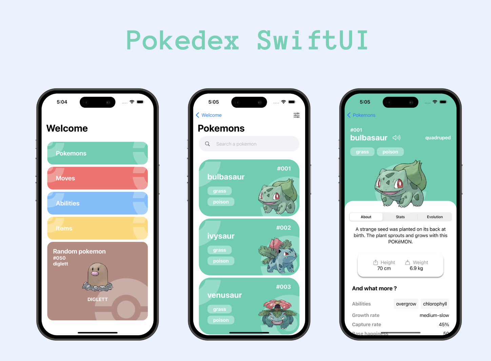

<h1 align="center">Pokedex SwiftUI</h1>

  
 

  

  
I created this Pokedex to improve my design skills with the swift UI framework. For the entire user interface, I tried to reproduce the pokédex of DamienToscano: <a href="https://pokedex-dev.vercel.app/">https://pokedex-dev.vercel.app/</a>

 

## Resume
- Swift 5
- Swift UI 
- MVVM
- Images lazy loaded
- Get all pokemons, moves, and items from JSON file
- API grabber available in files :
    I used a C# console application to retrieve all the data from the Poké API. I saved this data in JSON files. This avoided unnecessary calls.

